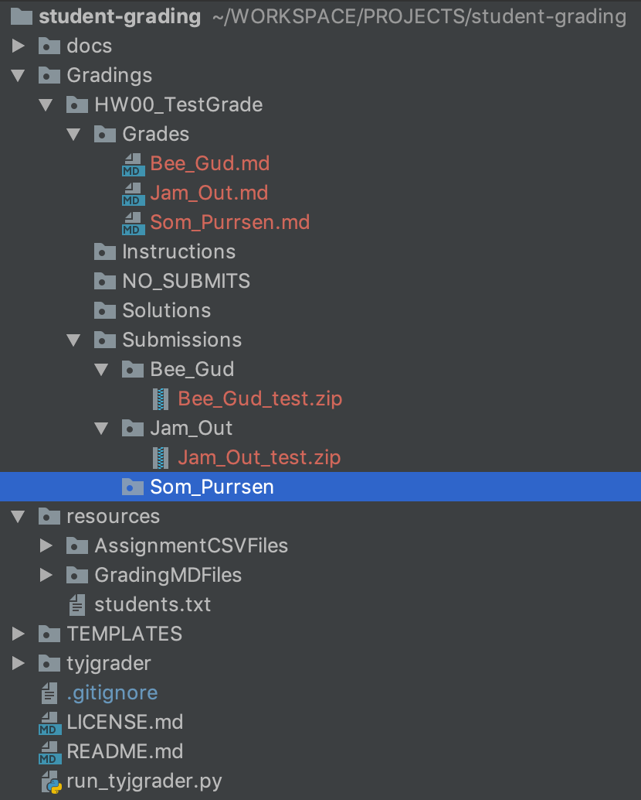

# student-grading
**A python module to simplify student grading from GitHub submissions**

## Overview
The program takes a `csv` file containing student names, and urls for assignment submissions on GitHub, then automates the process of creating directories and grading sheets for their submissions.

## run_tyjgrader.py
This script takes the following arguments in the specific formats given

- Assignment name starting with `Homework`, `Project`, `Classwork`, `Bonus` or some other capitalized single word.  The next sequence is a two digit number.  NOTE: Single digits should be prepended with a zero `0`. Then followed with a descriptive title.  All words are to be separated b a single underscore character `_`.  To sumarize, it is absolutely mandatory that the format is in the following general format:  `Word_01_Some_Title_Here`

- A relative path from the directory which this script is in to the text file containing the list of students. (See Students.txt format notes below.)
- A relative path from the directory which this script is in to the markdown file that is the "template" for the assignment. (See AssignmentGradingTEMPLATE.md description and formatting notes below.)
- A series of key/value arguments used to populate fields in the markdown grading files.  The keys require quotes and surrounded by <> symbols (ie : `"<name>"`).  The keys are :
  
    - `<name>` - The value of this key is non-relevant, and just a place holder, so `null` is fine.
    - `<assignment` - A string literal (in quotes) that will be the printed title of the assignment on generated grading sheets
    - `<due>` - A date value. TBD // ToDo:

### Running the script

The general call signature is as follows:

```
python run_tyjgrader.py <Underscore_Title> <path_to_csv> <pathToMarkDownTEMPLATE> <name> null <assignment> "<assignment name"> <due> "<date as string>" 
```
_**EXAMPLE**_
```
python run_tyjgrader.py HW_03_Python resources/students.csv resources/TEMPLATEAssignmentGrading.md <name> null <assignment> "Homework - 03 Python" <due> "May 31, 2019"
```
## Output

Given the following student `csv` file : 
```
Bee Gud, https://github.com/bennowak/student-grading/tree/master
Som Purrsen, https://github.com/bennowak/student-grading/tree/master
Jam Out, https://github.com/bennowak/student-grading/tree/master
```

Running the example command at the command line will yield the following structure : 



## Folder Organization Concerns

This program is intended to reside inside a single directory where the grader (TA, Instructor, etc.) does all of their grading.  This will mean that each call to the program should supply different arguments for different assignments.  Rerunning the script with the same arguments may either overwrite previously existent files or simply fail to execute part of the script.  So what does this look like as originally intended by the author.

    - `Grading` (folder)
        - Homework01_Some_Homework
        - Homework02_Some_more_homework
        - Resources
            - hw1_students.csv
            - hw2_students.csv
            - hw1_gradingTemplate.md
            - hw2_gradingTemplate.md
            - GRADING_TEMPLATE.md
        - `tyjgrader` (module folder)

Before running the script: 
- a copy of the GRADING_TEMPLATE.md file has been customized to reflect the rubric and grading concerns for that particular assignment
- a separate `csv` for each assignment has been created containing valid URLs pointing to the GitHub `master` branch for the relevant student's submission
- arguments to the program have been entered meticulously and accurately

## If An Error Occurs

- Delete the folder for that assignment and try again and check the formatting of your csv and arguments to the `run_tyjgrader.py` script.

- Report issues here [here](https://github.com/bennowak/student-grading/issues)


```
    TYJ Student Grading
    Copyright (C) 2019  Benjamin Nowak

    This program is free software: you can redistribute it and/or modify
    it under the terms of the GNU Affero General Public License as
    published by the Free Software Foundation, either version 3 of the
    License, or (at your option) any later version.

    This program is distributed in the hope that it will be useful,
    but WITHOUT ANY WARRANTY; without even the implied warranty of
    MERCHANTABILITY or FITNESS FOR A PARTICULAR PURPOSE.  See the
    GNU Affero General Public License for more details.

    You should have received a copy of the GNU Affero General Public License
    along with this program.  If not, see http://www.gnu.org/licenses/.
```